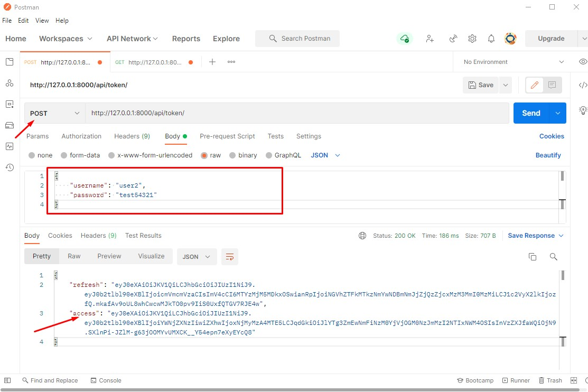
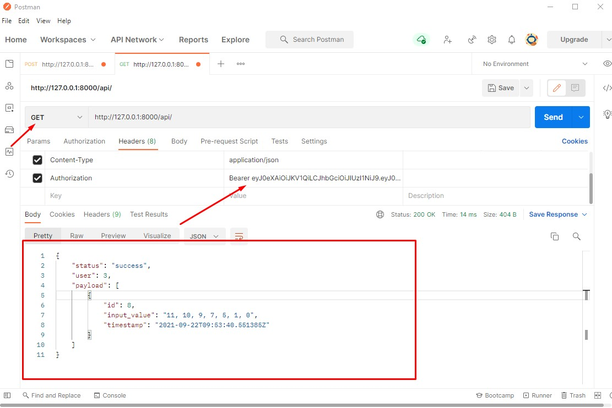

# Project Live Host 
I deployed this project on Heroku server <br>
Project live [https://evidentcodingtest.herokuapp.com/](https://evidentcodingtest.herokuapp.com/) <br>

 # Project run on local machine
 First you need to install in your machine python, then install virtualenv package. <br>
 open your terminal and run 
 ```pip install virtualenv```
 <br>
 # Project clone
 Now clone project from github with command: ```git clone https://github.com/MehediBijoy/Evident-coding-test.git```
 
 # Create virtaulenv
 open your Terminal inside your project folder, now you create environment with the command <br>
 ```virtualenv venv```
 
 # Active virtualenv
 ```venv\scripts\activate```
 
 # Install packages
 install all packages from requirements.txt <br>
 ``` pip install -r requirements.txt```
 
 # Project server run
 ```python manage.py runserver``` <br>
 Then go to [http://127.0.0.1:8000](http://127.0.0.1:8000) in your browser
 
 # API Testing
 I use jwt token authentication in my project, so first we need a to token for any specific user. open postman and post request to the url
 ```http://127.0.0.1:8000/api/token/``` <br>
 also post the username and password for token, given screenshot below <br>
 Now get two token, first is refresh token and second one is access token. Copy access token.
<kbd></kbd>

now get request to my ```http://127.0.0.1:8000/api/``` with pass the access token in header. You must add ```Bearer``` with token, please check screenshot <br><br>
<kbd></kbd>

That's all, Thank you <3 
